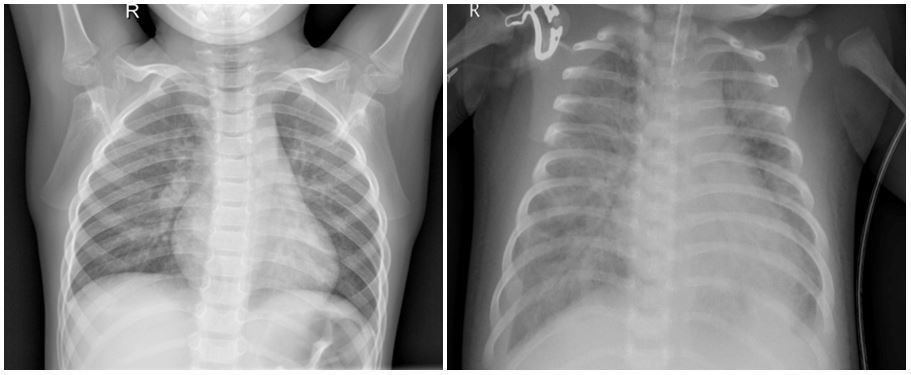
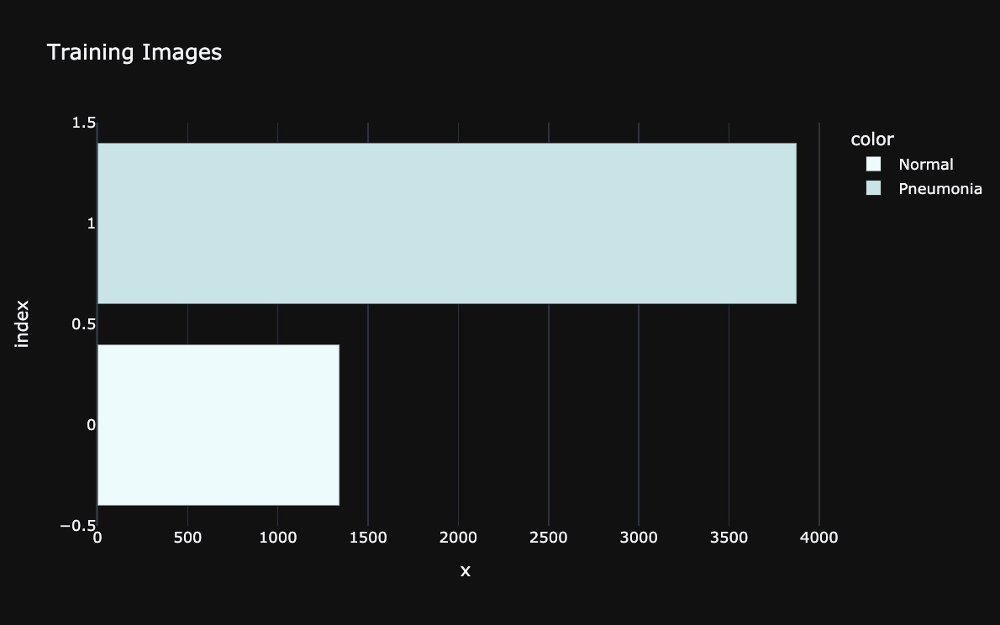

# PNAImageClassification



**Overview**

To easily view this notebook in nbviewer, please click [here](https://nbviewer.org/github/teigen30/PNAImageClassification/blob/main/PneumoniaXrayClassification.ipynb)

This project analyses over 5,800 chest x-ray images taken of pediatric patients both with and without pneumonia and develops a binary classification model to predict whether a patient has pneumonia or not. The JPEG images were selected from groups of pediatric patients ages one to five years old from Guangzhou Women and Children's Medical Center, Guangzhou China. The World Health Organization (WHO) is requesting a model to help accurately predict pneumonia in young patients. 

**Business and Data Understanding**

Pneumonia is the single largest infectious cause of death in children worldwide and results in 22% of all deaths in children aged 1 to 5. Early identification and intervention is key in reducing the death rate of children with pneumonia. WHO will use the model to help identify the early stages of pneumonia in children, therefore giving providers sufficient time to administer medication in order to ameliorate the patient’s illness. When building the model, careful consideration was taken to identify and remedy false negative pneumonia results. A false negative in this case incorrectly identifies the patient as being healthy when they have pneumonia. False negatives are the most dangerous as they allow the illness to progress in the absence of medical intervention.

Our dataset is provided by Mendeley Data and uses over 5800 chest x-ray images of pediatric patients ages one to five from Guangzhou Women and Children's Medical Center. The images were taken as part of the patients’ routine care. The images were analysed by two expert physicians before being cleared for use in training the AI system and a third expert validated the analysis.

**Stakeholder Audience**

The stakeholder for this proposal is the World Health Organization (WHO). WHO’s mission statement includes their goal of resolving the human resources for health crisis. To help meet that goal, our project aims at providing a model to identify pneumonia in x-ray images without the help of an experienced radiologist, the doctor that would typically assessing the x-ray images and providing the results. This makes pneumonia diagnosis more accessible to people all over the world, specifically in isolated areas with little to know medical staff nearby. Additionally, the model will help to reduce costs, as it cuts out the work of the experienced doctor needed to evaluate the x-rays.

**Modeling**

CNN

Initial Exploration: 

A separate validation set of images was created due to the small size of the provided validation set (16 images).  The folder of pneumonia verified x-ray images was just under four times larger than the folder for healthy x-rays and will be dealt with by transforming the normal images to increase the number of them in future model iterations. Due to computational limitations, images were reduced from an average height/width of 968 x 1320 pixels to 255 x 255 pixels. A test train split was used to separate image data into test, train, and validation (holdout) folders.


Baseline Model: 

The baseline model was a simple CNN consisting of one flatten and two dense layers. The baseline model resulted in a test loss of 0.6862 and a test accuracy of 0.6259.

Final Model: 

The final model was a more complex CNN made up of ____ layers. About the layers … 

**Model Results**

Parameter Tuning: 

Recommendations: 

Our recommendation to WHO is to deploy our model, or one similar, in locations where there are few experts in x-ray image analysis or where pneumonia has proven to be a consistent issue. By doing so, WHO could help diagnose and treat individuals for pneumonia who otherwise would likely not be examined for weeks if at all.

**Conclusion**

A CNN was created that correctly identified x-ray images as having pneumonia ____% of the time and identified _____ ___% of the time. This model would be extremely helpful for individuals living in isolated regions where pneumonia is common with little to no access to healthcare professionals.

Future Work: 

In the future, we would like to create a model that would be able to identify the type of pneumonia (viral/bacterial) present in the patient as treatments for the two types vary. Additionally, we would like to create a similar model using audio recordings of an individual’s breathing to identify the same thing. Doing so would extend the potential reach and impact of our model by enabling individuals with no access to x-ray technology to be diagnosed as well. The final thing which we would like to take into account in future models is the air quality of the individuals affected.

**Presentation Link:** 

[Presentation Link](https://www.canva.com/design/DAEv_SZ5S5s/4oebG7_dX6h5wyX9MICMgw/view?utm_content=DAEv_SZ5S5s&utm_campaign=designshare&utm_medium=link&utm_source=publishsharelink)

**Repository Navigation**

```
├── README.md                                   <- The top-level README for reviewers of this project. 
├── Jen                                         <- Notebook containing work from Jen S
├── Jennifer C                                  <- Notebook containing work from Jennifer C
├── PneumoniaXrayClassification.ipynb           <- Final combined notebook with EDA, Visualizations, Explanations, Model Iterations, and our Final Model. 
├── images                                      <- Contains images used for README.md and notebook. 
├── presentation.pdf                            <- PDF of the Canva presentation. 
├── utils.py                                    <- Helpful functions to use in our final notebook
├── utils2.py                                   <- Helpful functions to use in our final notebook
├── utils3.py                                   <- Helpful functions to use in our final notebook
└── utils20.py                                  <- Helpful functions to use in our final notebook
```
